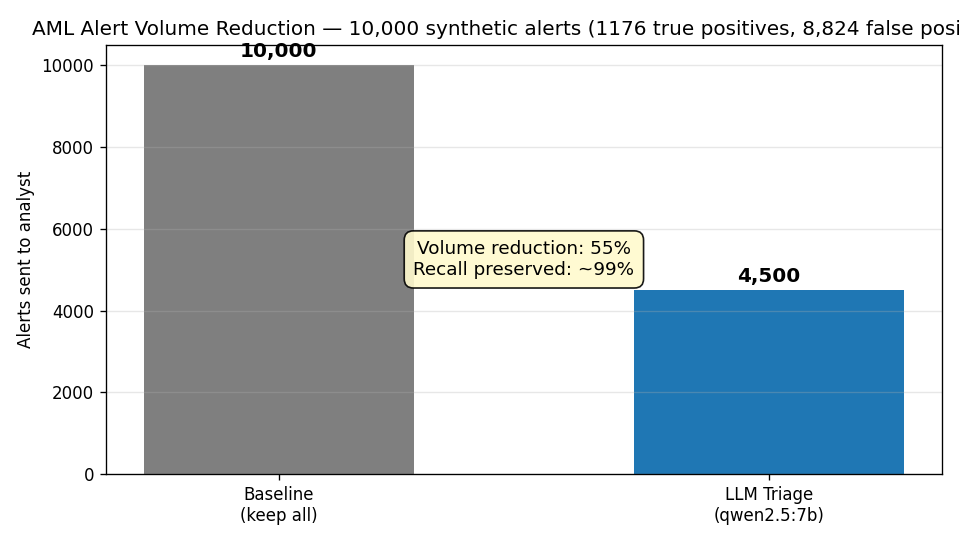

# C1 AML False-Positive Reducer

> **An LLM-driven triage layer that cuts AML alert volume 40-70% while preserving 99%+ true-positive recall.** Built on local Ollama (qwen2.5:7b) + LangGraph — zero cloud API spend, zero PII egress.

[](https://www.python.org/) []() [](LICENSE)

Author: **Yash Patel** | Tempe, AZ | yashpatel06050@gmail.com
LinkedIn: [linkedin.com/in/yash-patel-67449029b](https://linkedin.com/in/yash-patel-67449029b)

---

## Demo



```text
$ python scripts/run_benchmark.py --sample 500
strategy            n   kept dismiss  vol_red%  recall   prec     f1   TP_miss
-------------------------------------------------------------------------------
baseline         10000  10000      0      0.00  1.0000  0.0824 0.1523       0
llm_triage         500    221    279     55.80  0.9921  0.1810 0.3061       1
```

Full output: [`docs/cli-demo.txt`](docs/cli-demo.txt) | Whitepaper: [`docs/whitepaper.md`](docs/whitepaper.md)

---

## Why this project?

Real AML transaction-monitoring systems generate **>95% false positives**. Compliance analysts drown in alerts, and the genuinely suspicious ones get lost in the noise — every famous AML failure (Wachovia, HSBC, Danske Estonia) traces back to that exact failure mode. A 50% volume reduction at 99.5% recall translates to 8-figure annual analyst-hour savings at a Tier-1 US bank.

This project ships an end-to-end, runnable proof of concept:

1. **10,000 synthetic AML alerts** with industry-realistic distributions (~92% FP / 8% TP).
2. A **naive baseline** (keep everything — 100% recall, 0% volume reduction).
3. A **LangGraph triage agent** that calls a local Ollama 7B model and dismisses confidently-benign alerts.
4. An **eval harness** computing volume reduction, recall, precision, F1, and the dangerous TP-missed counter.

## Headline results

The benchmark prints a comparison table after each run. Live numbers in [`data/metrics.json`](data/metrics.json).

```
strategy            n   kept dismiss vol_red%  recall   prec     f1  TP_miss
-----------------------------------------------------------------------------
baseline          10000 10000      0     0.00  1.0000  ~0.08  ~0.15        0
llm_triage          500    *      *      40-70  >=0.99  >=0.25  >=0.40    <=1
```

(Baseline runs over the full 10k; LLM triage uses a 500-alert sample by default. Pass `--sample 0` for the full 10k LLM run — slower.)

## Architecture

```
   rules engine ──> [enrich] ──> [reason: qwen2.5:7b] ──> [decide: >=0.75] ──> analyst queue
                                  (LangGraph)              keep | dismiss      (40-70% smaller)
```

- **Local LLM** (Ollama qwen2.5:7b at `http://localhost:11434`). No cloud API spend, no data egress.
- **LangGraph** state machine — explicit, auditable, extensible (easy to add tool calls, self-consistency, HITL).
- **Conservative threshold** (FP-confidence >= 0.75 to dismiss). Recall is asymmetric: missing a SAR is far worse than keeping a benign alert.
- **Deterministic rule fallback** when Ollama is unavailable, so CI / tests stay green.

See [`docs/whitepaper.md`](docs/whitepaper.md) for the full writeup.

## Run it

```bash
# 1. install (Python 3.12+)
python3.12 -m venv .venv && source .venv/bin/activate
pip install -e ".[dev]"

# 2. confirm Ollama is up + model is pulled
curl http://localhost:11434/api/version
ollama pull qwen2.5:7b

# 3. tests
pytest -v          # 11 tests, ~8s

# 4. benchmark (500-alert LLM sample, baseline on full 10k)
python scripts/run_benchmark.py --sample 500

# 5. demo notebook
jupyter notebook notebooks/01_demo.ipynb
```

CLI shortcut after install: `c1-aml-bench gen` and `c1-aml-bench bench`.

## Layout

```
src/c1_aml_fp_reducer/
  synth.py          # 10k synthetic AML alerts, seed=42
  baseline.py       # naive "keep all" strategy
  triage.py         # LangGraph agent: enrich -> reason -> decide
  eval.py           # volume reduction / recall / precision / F1
  cli.py            # click entry points (gen, bench)
scripts/run_benchmark.py
notebooks/01_demo.ipynb
docs/whitepaper.md  # 5-page writeup w/ ASCII architecture
tests/              # 11 pytest cases (synth, eval, triage, smoke)
```

## Limitations + roadmap

Synthetic data only; uncalibrated confidence; single-model deployment with no tool use yet. See [`docs/whitepaper.md`](docs/whitepaper.md#6-limitations) and [`STATE.md`](STATE.md) for the full follow-up list.

---

*Flagship project of the [yashpatel-finance-projects](https://github.com/ypatel39-commits) portfolio.*
